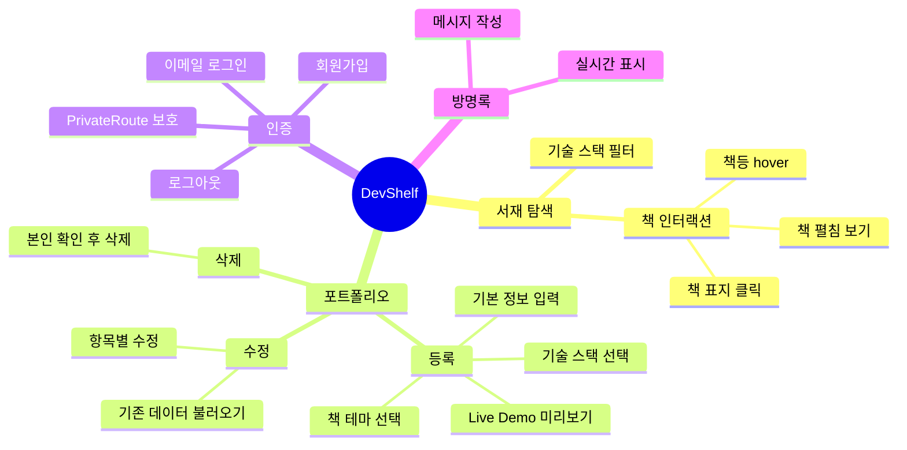
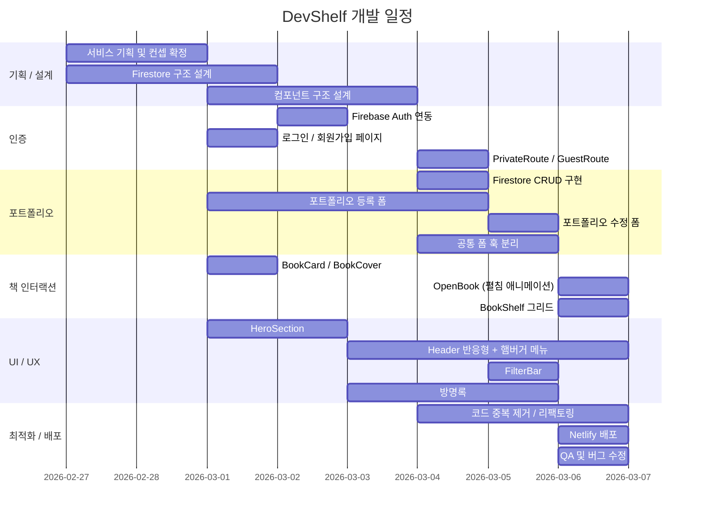
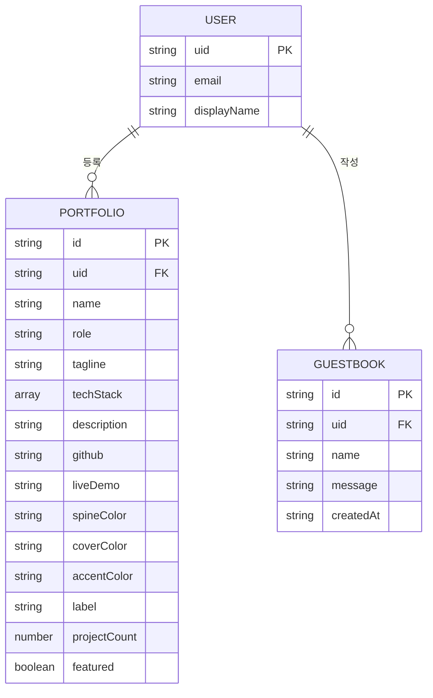
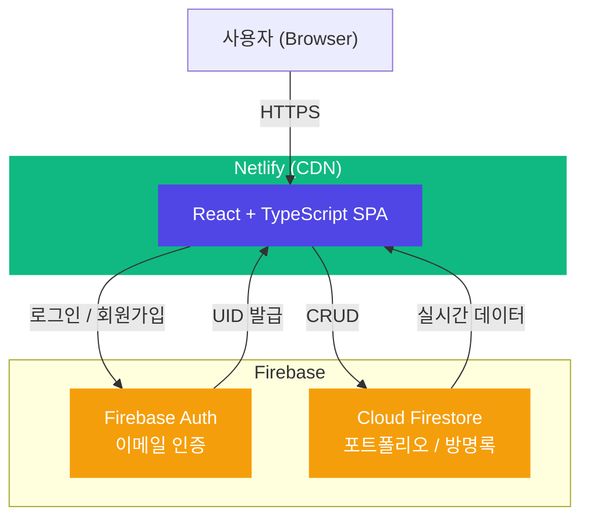
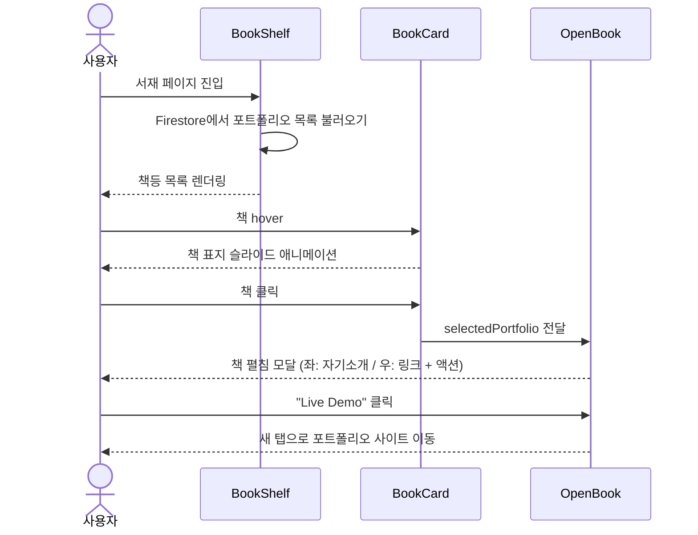
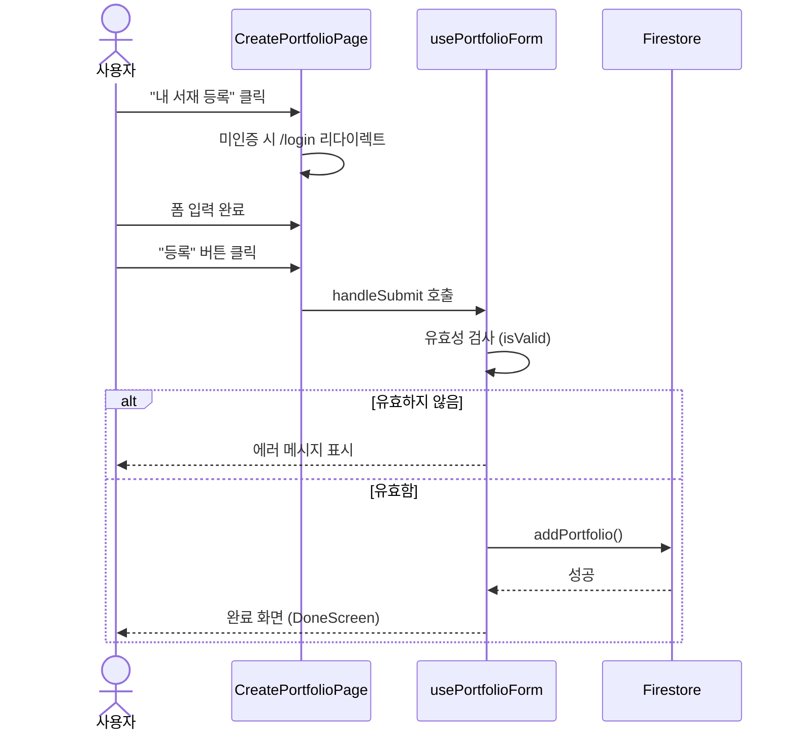

# DevShelf - 개발자의 서재

> 개발자의 포트폴리오를 "서재" 컨셉으로 탐색하는 웹 플랫폼

---

## 1. 목표와 기능

### 1.1 목표

- 개발자 포트폴리오를 **책등 → 책 표지 → 책 펼침** 인터랙션으로 탐색하는 독창적인 경험 제공
- Firebase 기반의 간편한 소셜 로그인과 실시간 데이터 동기화로 낮은 진입 장벽 실현
- 기술 스택 필터링을 통해 원하는 개발자를 빠르게 발견할 수 있는 서재 탐색 플랫폼 구축

### 1.2 기능

- **서재 탐색**: 기술 스택 필터로 개발자 포트폴리오를 책 형태로 탐색
- **포트폴리오 등록**: 이름, 직군, 한 줄 소개, 기술 스택, GitHub, Live Demo URL, 자기소개 입력 및 책 테마 선택
- **포트폴리오 수정 / 삭제**: 본인 포트폴리오에 한해 수정 및 삭제 가능
- **Live Demo 미리보기**: 등록 전 포트폴리오 URL을 iframe으로 미리 확인
- **방명록**: 메인 페이지에서 방문자가 자유롭게 메시지 남기기
- **로그인 / 회원가입**: Firebase Auth 기반 이메일 인증
- **모바일 대응**: 햄버거 메뉴를 포함한 반응형 레이아웃

### 1.3 팀 구성

실제 사진을 업로드해 주세요.

<table>
  <tr>
    <th>이름</th>
    <th>이름</th>
    <th>이름</th>
  </tr>
  <tr>
    <td></td>
    <td></td>
    <td></td>
  </tr>
</table>

---

## 2. 개발 환경 및 배포 URL

### 2.1 개발 환경

| 구분 | 기술 |
|---|---|
| **Framework** | React 18 + TypeScript |
| **Build Tool** | Vite |
| **Package Manager** | npm |
| **Styling** | TailwindCSS |
| **Animation** | Framer Motion |
| **Routing** | React Router v6 |
| **Backend / BaaS** | Firebase Auth + Cloud Firestore |
| **Deployment** | Netlify |

### 2.2 배포 URL

- **Production**: `https://thedevshelf.netlify.app/`
- 테스트 계정
  ```
  id: test@devshelf.dev
  pw: test1234!
  ```

### 2.3 URL 구조

| URL | 페이지 | 설명 | 로그인 필요 |
|---|---|---|:---:|
| `/` | 메인 | 히어로 섹션 + 방명록 | |
| `/shelf` | 서재 | 전체 포트폴리오 탐색 | |
| `/login` | 로그인 | 이메일 로그인 (로그인 상태면 `/`로 리다이렉트) | |
| `/register` | 회원가입 | 이메일 회원가입 (로그인 상태면 `/`로 리다이렉트) | |
| `/portfolio/new` | 포트폴리오 등록 | 새 포트폴리오 작성 | O |
| `/portfolio/edit/:id` | 포트폴리오 수정 | 본인 포트폴리오 수정 | O |

### 2.4 Firestore 컬렉션 구조

| 컬렉션 | 문서 필드 | 설명 |
|---|---|---|
| `portfolios` | `id, uid, name, role, tagline, techStack, description, github, liveDemo, spineColor, coverColor, accentColor, label, projectCount, featured` | 개발자 포트폴리오 |
| `guestbook` | `id, uid, name, message, createdAt` | 방명록 메시지 |

---

## 3. 요구사항 명세와 기능 명세



---

## 4. 프로젝트 구조와 개발 일정

### 4.1 프로젝트 구조

```
the-developers-library/
├── public/
├── src/
│   ├── components/
│   │   ├── book/
│   │   │   ├── BookCard.tsx        # 서재의 개별 책 카드
│   │   │   ├── BookCover.tsx       # 책 표지 컴포넌트
│   │   │   ├── BookPageLeft.tsx    # 펼친 책 왼쪽 페이지
│   │   │   ├── BookPageRight.tsx   # 펼친 책 오른쪽 페이지 (액션)
│   │   │   ├── BookShelf.tsx       # 서재 전체 그리드
│   │   │   └── OpenBook.tsx        # 책 펼침 모달
│   │   ├── FilterBar.tsx           # 기술 스택 필터
│   │   ├── FloatingParticles.tsx   # 배경 파티클 애니메이션
│   │   ├── Footer.tsx
│   │   ├── Header.tsx              # 반응형 헤더 + 모바일 햄버거 메뉴
│   │   ├── HeroSection.tsx         # 메인 히어로 섹션
│   │   ├── PortfolioFormShared.tsx # 폼 공유 컴포넌트 모음
│   │   └── PortfolioModal.tsx
│   ├── contexts/
│   │   └── AuthContext.tsx         # Firebase Auth 전역 상태
│   ├── data/
│   │   ├── bookThemes.ts           # 책 테마 상수 (단일 출처)
│   │   ├── portfolios.json         # 개발 환경 샘플 데이터
│   │   └── stacks.ts               # 기술 스택 목록
│   ├── hooks/
│   │   ├── useEditPortfolioForm.ts # 수정 폼 훅
│   │   ├── usePortfolioForm.ts     # 등록 폼 훅
│   │   ├── usePortfolioFormBase.ts # 공통 폼 로직 베이스 훅
│   │   └── usePortfolios.ts        # 포트폴리오 목록 훅
│   ├── lib/
│   │   ├── firebase.ts             # Firebase 초기화
│   │   └── portfolioService.ts     # Firestore CRUD
│   ├── pages/
│   │   ├── CreatePortfolioPage.tsx
│   │   ├── EditPortfolioPage.tsx
│   │   ├── LoginPage.tsx
│   │   ├── MainPage.tsx
│   │   ├── RegisterPage.tsx
│   │   └── ShelfPage.tsx
│   ├── types/
│   │   └── index.ts                # Portfolio, GuestbookMessage, TechStack 타입
│   ├── App.tsx                     # 라우터 + PrivateRoute / GuestRoute
│   ├── index.css
│   └── main.tsx
├── .env.local                      # Firebase 환경 변수 (비공개)
├── index.html
├── package.json
├── tailwind.config.js
├── tsconfig.json
└── vite.config.ts
```

### 4.2 개발 일정(WBS)



---

## 5. 역할 분담

| 역할 | 이름 | 담당 |
|---|---|---|
| 팀장 | 이름 | 서비스 기획, Firebase 설계, 포트폴리오 CRUD |
| FE | 이름 | 책 인터랙션 (BookCard, OpenBook), 애니메이션 |
| FE | 이름 | 인증 페이지, Header, 방명록 |

---

## 6. 와이어프레임 / UI / BM

### 6.1 와이어프레임

와이어프레임 이미지를 아래에 첨부하세요.


### 6.2 화면 설계

<table>
  <tbody>
    <tr>
      <td>메인 페이지</td>
      <td>서재 (Shelf)</td>
    </tr>
    <tr>
      <td></td>
      <td></td>
    </tr>
    <tr>
      <td>책 펼침 (OpenBook)</td>
      <td>포트폴리오 등록</td>
    </tr>
    <tr>
      <td></td>
      <td></td>
    </tr>
    <tr>
      <td>로그인</td>
      <td>방명록</td>
    </tr>
    <tr>
      <td></td>
      <td></td>
    </tr>
  </tbody>
</table>

---

## 7. 데이터베이스 모델링(ERD)

Firebase Firestore는 NoSQL 문서형 DB이므로 아래와 같이 컬렉션 구조로 표현합니다.



---

## 8. Architecture



---

## 9. 메인 기능

### 책 인터랙션 흐름



### 포트폴리오 등록 흐름



---

## 10. 에러와 에러 해결

| 에러 | 원인 | 해결 |
|---|---|---|
| `BOOK_THEMES` 상수 중복 | `usePortfolioForm`과 `useEditPortfolioForm` 양쪽에 동일 상수 정의 | `src/data/bookThemes.ts`로 추출 후 양 훅에서 import |
| 수정 폼 useEffect 무한루프 | `base.setForm`이 의존성 배열에 포함되어 렌더마다 참조 변경 | `eslint-disable react-hooks/exhaustive-deps` 처리 + `portfolioId`, `user?.uid`만 의존성으로 지정 |
| `Portfolio` 타입 `label` 누락 | `...selectedTheme` spread 시 `label` 필드가 Firestore에 저장되지만 타입에 없음 | `types/index.ts`의 `Portfolio` 인터페이스에 `label?: string` 추가 |
| 모바일 네비게이션 미구현 | 초기 Header에 모바일 메뉴 없음 | Framer Motion `AnimatePresence` + 햄버거 버튼으로 드롭다운 메뉴 구현 |
| 샘플 데이터가 프로덕션에 노출 | `portfolios.json`이 환경 구분 없이 항상 병합 | `import.meta.env.DEV` 조건으로 개발 환경에서만 샘플 데이터 병합 |

---

## 11. 개발하며 느낀 점

팀원 개인 회고를 작성해 주세요.

- **이름**:
- **이름**:
- **이름**:
