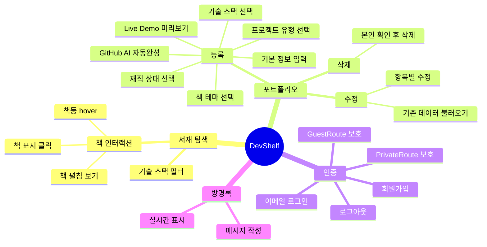
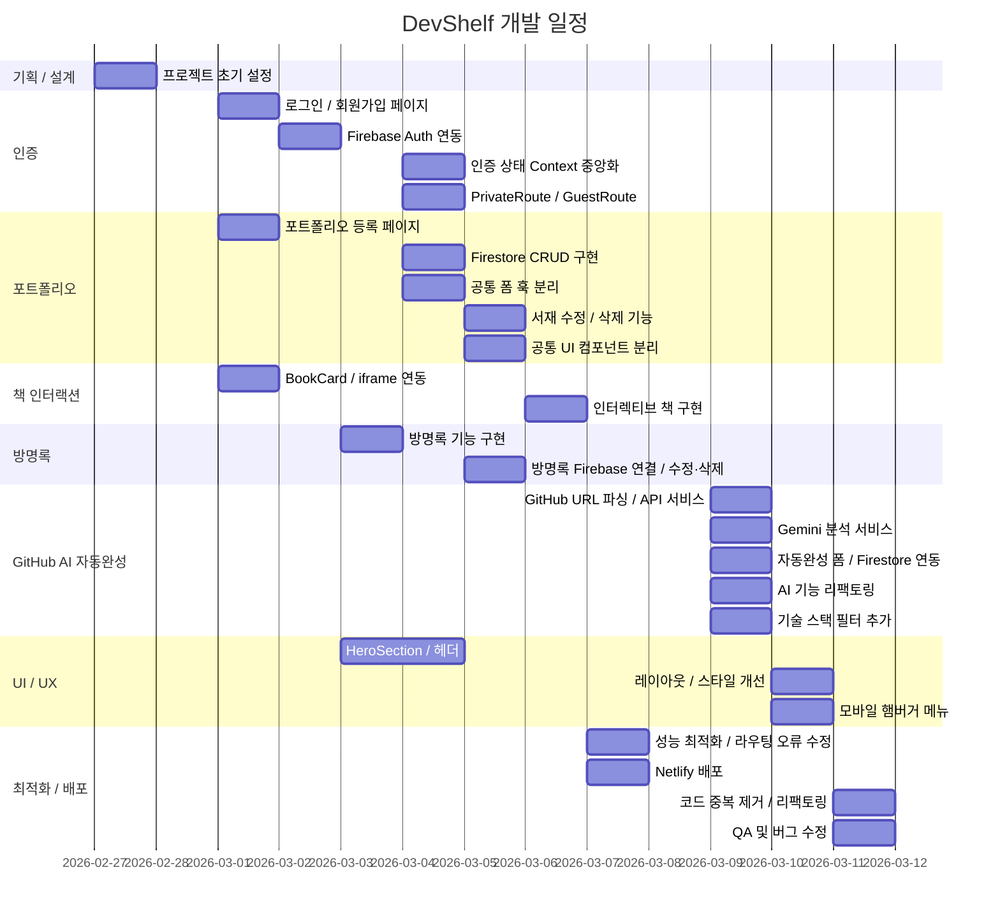
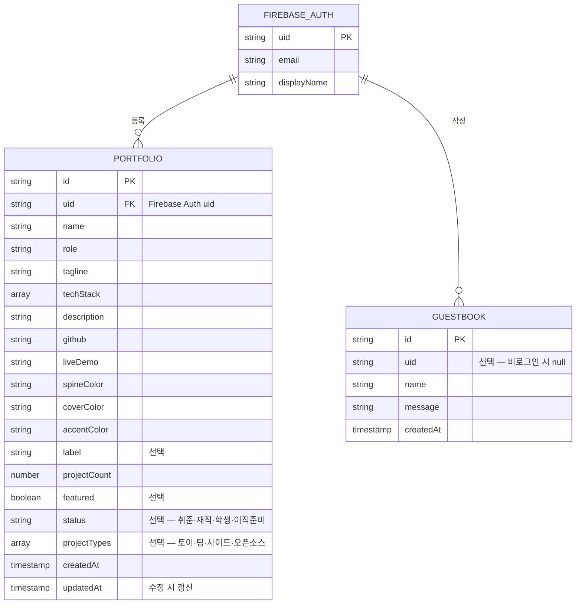
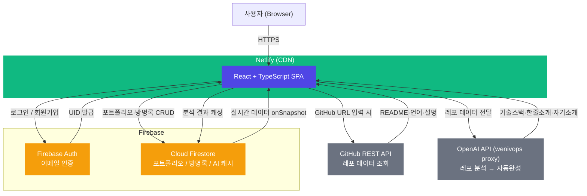
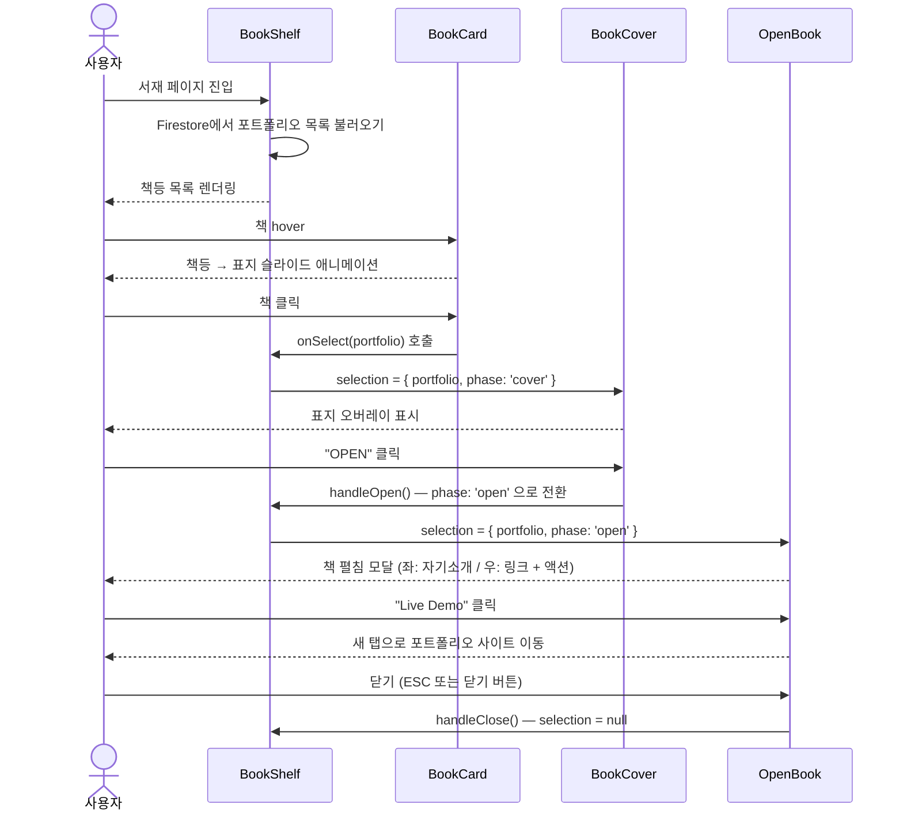
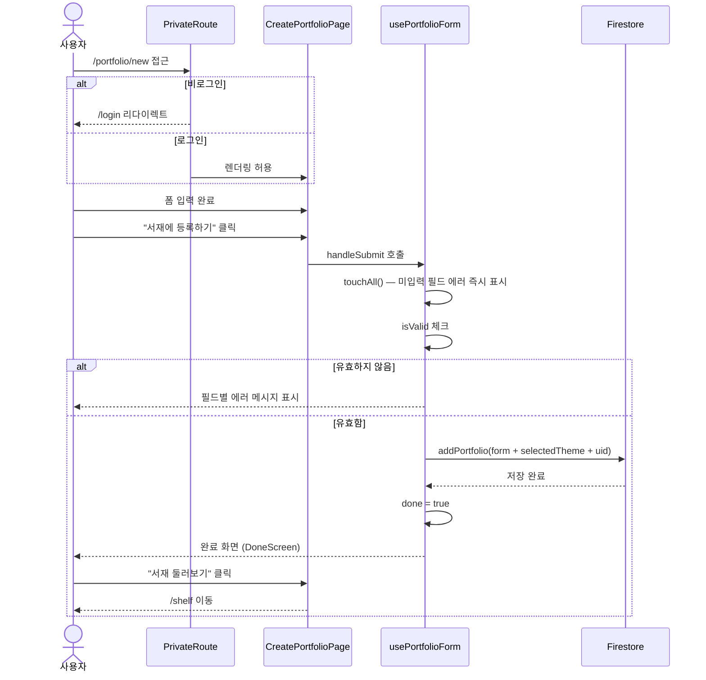
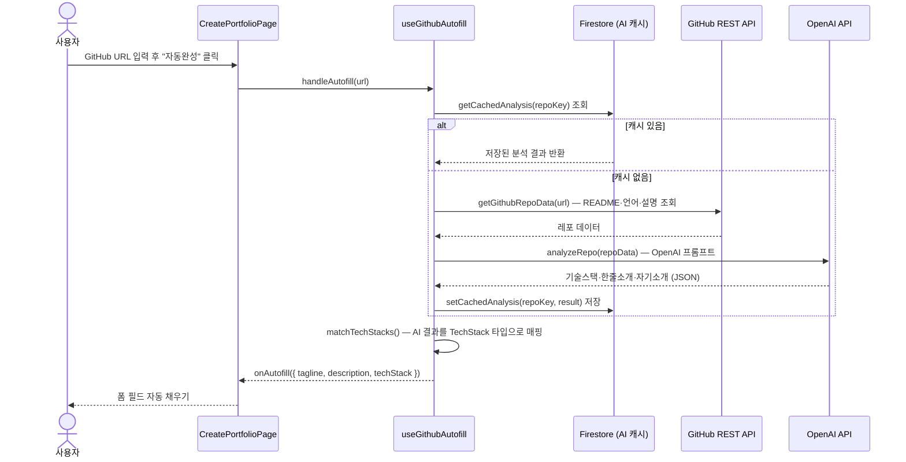

# DevShelf - 개발자의 서재

> 개발자의 포트폴리오를 "서재" 컨셉으로 탐색하는 웹 플랫폼

---

## 1. 목표와 기능

### 1.1 목표

- 개발자 포트폴리오를 **책등 → 책 표지 → 책 펼침** 인터랙션으로 탐색하는 독창적인 경험 제공
- Firebase 기반의 로그인과 실시간 데이터 동기화로 낮은 진입 장벽 실현
- 기술 스택 · 직군 상태 필터링을 통해 원하는 개발자를 빠르게 발견할 수 있는 서재 탐색 플랫폼 구축

### 1.2 기능

- **서재 탐색**: 기술 스택 필터로 개발자 포트폴리오를 책 형태로 탐색
- **포트폴리오 등록**: 이름, 직군, 한 줄 소개, 기술 스택, 재직 상태, 프로젝트 유형, GitHub, Live Demo URL, 자기소개 입력 및 책 테마 선택
- **GitHub AI 자동완성**: GitHub 레포 URL 입력 시 기술 스택 · 한 줄 소개 · 자기소개를 자동으로 채워주는 기능
- **포트폴리오 수정 / 삭제**: 본인 포트폴리오에 한해 수정 및 삭제 가능
- **Live Demo 미리보기**: 등록 전 포트폴리오 URL을 iframe으로 미리 확인
- **방명록**: 메인 페이지에서 방문자가 자유롭게 메시지 남기기
- **로그인 / 회원가입**: Firebase Auth 기반 이메일 인증
- **모바일 대응**: 햄버거 메뉴를 포함한 반응형 레이아웃

### 1.3 팀 구성

실제 사진을 업로드해 주세요.

<table>
  <tr>
    <th>김남희</th>
    <th>김성민</th>
    <th>김유진</th>
    <th>김지민</th>
    <th>이영미</th>
    <th>조현진</th>
  </tr>
  <tr>
    <td></td>
    <td></td>
    <td></td>
    <td></td>
    <td></td>
    <td></td>
  </tr>
</table>

---

## 2. 개발 환경 및 배포 URL

### 2.1 개발 환경

| 구분 | 기술 |
|---|---|
| **Framework** | React 19 + TypeScript 5.9 |
| **Build Tool** | Vite 7 |
| **Package Manager** | npm |
| **Styling** | TailwindCSS v4 |
| **Animation** | Framer Motion 12 |
| **Routing** | React Router v7 |
| **Backend / BaaS** | Firebase 12 — Auth + Cloud Firestore |
| **Deployment** | Netlify |

### 2.2 배포 URL

- **Production**: `https://thedevshelf.netlify.app/`
- 테스트 계정
  ```
  id: test@devshelf.dev
  pw: test1234!
  ```

### 2.3 URL 구조

| URL | 페이지 | 설명 | 인증 |
|---|---|---|:---:|
| `/` | 메인 | 히어로 섹션 + 방명록 | |
| `/shelf` | 서재 | 전체 포트폴리오 탐색 | |
| `/login` | 로그인 | 로그인 상태면 `/` 리다이렉트 (GuestRoute) | |
| `/register` | 회원가입 | 로그인 상태면 `/` 리다이렉트 (GuestRoute) | |
| `/portfolio/new` | 포트폴리오 등록 | 비로그인 시 `/login` 리다이렉트 (PrivateRoute) | ✓ |
| `/portfolio/edit/:id` | 포트폴리오 수정 | 본인 포트폴리오만 수정 가능 (PrivateRoute) | ✓ |

### 2.4 Firestore 컬렉션 구조

**portfolios**

| 필드 | 타입 | 설명 |
|---|---|---|
| `id` | string | 문서 ID |
| `uid` | string | 작성자 Firebase UID |
| `name` | string | 개발자 이름 |
| `role` | string | 직군 |
| `tagline` | string | 한 줄 소개 |
| `techStack` | array | 기술 스택 목록 |
| `description` | string | 자기소개 |
| `github` | string | GitHub URL |
| `liveDemo` | string | 포트폴리오 URL |
| `spineColor` | string | 책등 색상 |
| `coverColor` | string | 표지 색상 |
| `accentColor` | string | 강조 색상 |
| `label` | string | 테마 라벨 |
| `projectCount` | number | 프로젝트 수 |
| `featured` | boolean | 추천 여부 |
| `status` | string | 재직 상태 (선택) |
| `projectTypes` | array | 프로젝트 유형 목록 (선택) |

**guestbook**

| 필드 | 타입 | 설명 |
|---|---|---|
| `id` | string | 문서 ID |
| `uid` | string | 작성자 Firebase UID |
| `name` | string | 작성자 이름 |
| `message` | string | 방명록 내용 |
| `createdAt` | string | 작성 시각 |

---

## 3. 요구사항 명세와 기능 명세



---

## 4. 프로젝트 구조와 개발 일정

### 4.1 프로젝트 구조

```
the-developers-library/
├── public/
│   └── vite.svg
├── src/
│   ├── components/
│   │   ├── book/
│   │   │   ├── BookCard.tsx        # 서재의 개별 책 카드 (hover 애니메이션 포함)
│   │   │   ├── BookCover.tsx       # 책 표지 컴포넌트
│   │   │   ├── BookPageLeft.tsx    # 펼친 책 왼쪽 페이지 (자기소개)
│   │   │   ├── BookPageRight.tsx   # 펼친 책 오른쪽 페이지 (링크·수정·삭제)
│   │   │   ├── BookShelf.tsx       # 서재 전체 그리드 + 필터 연동
│   │   │   └── OpenBook.tsx        # 책 펼침 모달
│   │   ├── FilterBar.tsx           # 기술 스택 필터 바
│   │   ├── FloatingParticles.tsx   # 배경 파티클 애니메이션
│   │   ├── Footer.tsx              # 공통 푸터
│   │   ├── GitHubAutofill.tsx      # GitHub AI 자동완성 패널 UI
│   │   ├── Header.tsx              # 반응형 헤더 + 모바일 햄버거 메뉴
│   │   ├── HeroSection.tsx         # 메인 히어로 섹션
│   │   └── PortfolioFormShared.tsx # 폼 공유 컴포넌트
│   │                               #   FieldError · ToggleChip · BackButton
│   │                               #   SubmitError · FormActionButtons · DoneScreen 등
│   ├── contexts/
│   │   ├── AuthContext.tsx         # AuthContext Provider (Firebase Auth 연동)
│   │   └── authContextDef.ts       # AuthContextValue 인터페이스 + Context 생성
│   ├── data/
│   │   ├── bookThemes.ts           # 책 테마 색상 상수 (단일 출처)
│   │   ├── roles.ts                # 직군 목록
│   │   └── stacks.ts               # 기술 스택 목록 + 아이콘 매핑
│   ├── hooks/
│   │   ├── useAuth.ts              # AuthContext 구독 훅
│   │   ├── useEditPortfolioForm.ts # 수정 폼 훅 (기존 데이터 로딩 + Firestore 업데이트)
│   │   ├── useGithubAutofill.ts    # GitHub 레포 분석 → 스택·소개 자동완성 훅
│   │   ├── useLoginForm.ts         # 로그인 폼 상태 · 유효성 · 제출 훅
│   │   ├── usePortfolioForm.ts     # 등록 폼 훅 (Firestore 저장)
│   │   ├── usePortfolioFormBase.ts # 폼 공통 상태·유효성 로직 베이스 훅
│   │   ├── usePortfolios.ts        # 포트폴리오 목록 조회 + 필터링 훅
│   │   └── useRegisterForm.ts      # 회원가입 폼 상태 · 유효성 · 제출 훅
│   ├── lib/
│   │   ├── firebase.ts             # Firebase 앱 초기화
│   │   ├── guestbookService.ts     # 방명록 Firestore CRUD
│   │   └── portfolioService.ts     # 포트폴리오 Firestore CRUD
│   ├── services/
│   │   ├── aiService.ts            # OpenAI API 호출 → 레포 분석 결과 반환
│   │   ├── firestoreService.ts     # AI 분석 결과 Firestore 캐시 읽기/쓰기
│   │   └── githubService.ts        # GitHub REST API — README·언어·설명 조회
│   ├── pages/
│   │   ├── CreatePortfolioPage.tsx # 포트폴리오 등록 페이지
│   │   ├── EditPortfolioPage.tsx   # 포트폴리오 수정 페이지
│   │   ├── LoginPage.tsx           # 로그인 페이지
│   │   ├── MainPage.tsx            # 메인 페이지 (히어로 + 방명록)
│   │   ├── RegisterPage.tsx        # 회원가입 페이지
│   │   └── ShelfPage.tsx           # 서재 탐색 페이지
│   ├── types/
│   │   └── index.ts                # Portfolio · GuestbookMessage · TechStack
│   │                               # DevStatus · ProjectType 타입 정의
│   ├── utils/
│   │   ├── errors.ts               # unknown 에러 → 문자열 변환 유틸
│   │   └── parseGithubUrl.ts       # GitHub URL에서 owner/repo 파싱 유틸
│   ├── App.tsx                     # 라우터 설정 + PrivateRoute / GuestRoute
│   ├── index.css                   # 전역 스타일 (Tailwind + 커스텀 클래스)
│   └── main.tsx                    # 앱 진입점
├── .env.local                      # Firebase 환경 변수 (비공개, Git 제외)
├── .gitignore
├── eslint.config.js
├── index.html
├── package.json
├── package-lock.json
├── tsconfig.json
├── tsconfig.app.json
├── tsconfig.node.json
└── vite.config.ts
```

### 4.2 개발 일정(WBS)



---

## 5. 역할 분담

| 역할 | 이름 | 담당 |
|---|---|---|
| 팀장 | 김남희 | 플랫폼 기획 및 제작 |
| 팀원 | 김성민 | 포트폴리오 제작 |
| 팀원 | 김유진 | 플랫폼 기획, 포트폴리오 제작 |
| 팀원 | 김지민 | 포트폴리오 제작 |
| 팀원 | 이영미 | 포트폴리오 제작 |
| 팀원 | 조현진 | 포트폴리오 제작 |

---

## 6. 와이어프레임 / UI / BM

### 6.1 와이어프레임

와이어프레임 이미지를 아래에 첨부하세요.


### 6.2 화면 설계

<table>
  <tbody>
    <tr>
      <td>메인 페이지</td>
      <td>서재 (Shelf)</td>
    </tr>
    <tr>
      <td></td>
      <td></td>
    </tr>
    <tr>
      <td>책 펼침 (OpenBook)</td>
      <td>포트폴리오 등록</td>
    </tr>
    <tr>
      <td></td>
      <td></td>
    </tr>
    <tr>
      <td>포트폴리오 수정</td>
      <td>로그인</td>
    </tr>
    <tr>
      <td></td>
      <td></td>
    </tr>
    <tr>
      <td>회원가입</td>
      <td>방명록</td>
    </tr>
    <tr>
      <td></td>
      <td></td>
    </tr>
  </tbody>
</table>

---

## 7. 데이터베이스 모델링(ERD)

Firebase Firestore는 NoSQL 문서형 DB이므로 아래와 같이 컬렉션 구조로 표현합니다.
`FIREBASE_AUTH`는 Firestore 컬렉션이 아닌 Firebase Authentication이 관리하는 사용자 엔터티입니다.



---

## 8. Architecture



---

## 9. 메인 기능

### 책 인터랙션 흐름



### 포트폴리오 등록 흐름



### GitHub AI 자동완성 흐름



---

## 10. 에러와 에러 해결

| 에러 | 원인 | 해결 |
|---|---|---|
| `BOOK_THEMES` 상수 중복 | `usePortfolioForm`과 `useEditPortfolioForm` 양쪽에 동일 상수 정의 | `src/data/bookThemes.ts`로 추출 후 양 훅에서 import |
| 수정 폼 useEffect 무한루프 | `base.setForm`이 의존성 배열에 포함되어 렌더마다 참조 변경 | `eslint-disable react-hooks/exhaustive-deps` 처리 + `portfolioId`, `user?.uid`만 의존성으로 지정 |
| `Portfolio` 타입 `label` 누락 | `...selectedTheme` spread 시 `label` 필드가 Firestore에 저장되지만 타입에 없음 | `types/index.ts`의 `Portfolio` 인터페이스에 `label?: string` 추가 |
| 모바일 네비게이션 미구현 | 초기 Header에 모바일 메뉴 없음 | Framer Motion `AnimatePresence` + 햄버거 버튼으로 드롭다운 메뉴 구현 |
| 샘플 데이터가 프로덕션에 노출 | `portfolios.json`이 환경 구분 없이 항상 병합 | `import.meta.env.DEV` 조건으로 개발 환경에서만 샘플 데이터 병합 |
| 토글 버튼 스타일 3중 중복 | `TechStackFields`, `StatusField`, `ProjectTypeField`에 동일 버튼 스타일 반복 | `PortfolioFormShared.tsx`에 `ToggleChip` 내부 컴포넌트로 추출 후 세 필드에서 재사용 |
| 뒤로 가기 버튼 중복 | `CreatePortfolioPage`와 `EditPortfolioPage`에 동일한 뒤로 가기 버튼 JSX 반복 | `PortfolioFormShared.tsx`에 `BackButton` 컴포넌트로 추출 |
| 제출 에러 박스 중복 | 폼 페이지 두 곳에서 동일한 에러 애니메이션 블록 반복 | `PortfolioFormShared.tsx`에 `SubmitError` 컴포넌트로 추출 |
| `FieldErrorMsg` 로컬 중복 정의 | `RegisterPage`에 `PortfolioFormShared`의 `FieldError`와 동일한 컴포넌트를 별도 정의 | 로컬 함수 제거 후 공통 `FieldError` import로 통일 |

---

## 11. 개발하며 느낀 점

팀원 개인 회고를 작성해 주세요.

- **김남희**:
- **김성민**:
- **김유진**:
- **김지민**:
- **이영미**:
- **조현진**:
